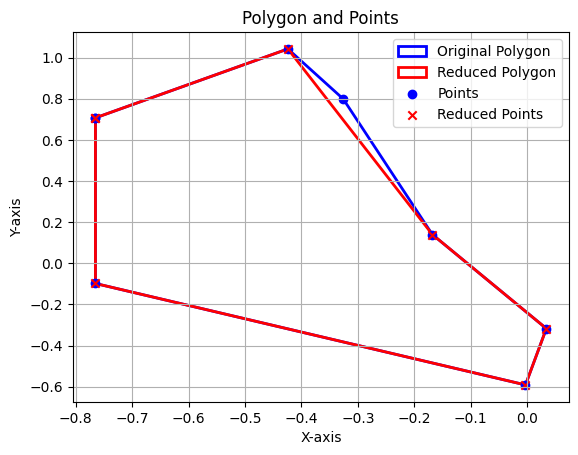

# Ramer-Douglas-Peucker-algorithm
### Use Ramer-Douglas-Peucker algorithm to reduce/optimize polygon points using linear algebra.

This project is focus on research only and I only use the pandas and numpy library. All the formulas applied can be found in the original research 

[Original Research](https://utpjournals.press/doi/abs/10.3138/FM57-6770-U75U-7727)


The Douglas–Peucker algorithm is an algorithm to smooth polylines, basically reduce the number of points in a line or shape based on a given tolerance parameter.

[Text Reference](https://cartography-playground.gitlab.io/playgrounds/douglas-peucker-algorithm/)


### Example usage:

```python
data = pd.read_csv("data/polygons_example.csv")

points = data[data["name"] == "Polygon1"]
points = points[["x", "y"]].to_numpy()

mask = get_reduced_points(points=points, threshold=0.4)

reduced_points = points[mask]
```

Starting with a curve based on a set of points such as 

$C = (P_1, P_2, P_3,...,P_n)$

We need to find the point that maximize the perpendicular distance from the line segment, if the maximum distance is less than a given threshold, then we can discard

$d_{\text{max}} = \max_{i=2}^{n-1} d(p_i, L)$

This will be applied recursively through the entire matrix.

